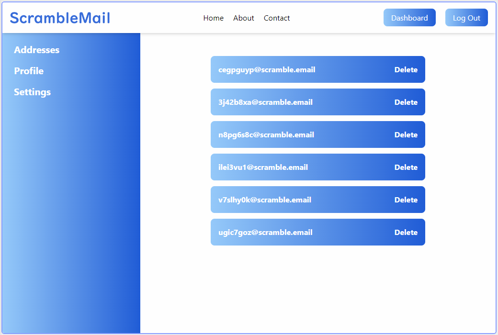

# ScrambleMail

[](https://opensource.org/licenses/MIT)

## https://scramble.email

## Description

An email forwarding service that protects your identity by randomizing email address.

Right-clicking any login form will allow you to generate a randomized email address in seconds, which will forward all emails back to your primary address.

This masks your true address in the event that the service experiences a data breach.

## Table of Contents

* [Installation](#installation)
* [Usage](#usage)
* [License](#license)
* [Questions](#questions)

## Installation

Clone the repository and run ```npm run build``` in the root directory. This will set up the server and client.

### Extension

Install the chrome extension by loading it as an [unpacked extension](https://developer.chrome.com/docs/extensions/mv3/getstarted/development-basics/#load-unpacked).

The unpacked extension is located in the ```addon``` directory.

### Additional requirements

This project requires a mongoDB database for operation, and uses [CloudMailIn](https://www.cloudmailin.com/) for email services.

## Usage

Visit https://scramble.email/ and sign up. Once you are logged in, you will be able to generate addresses by using the extension.

*Please note that this is a student project and continued operation of the service is not guaranteed. Do not use this service for any important accounts.*

### Site preview



## License

This project uses the [MIT](https://opensource.org/licenses/MIT) license.


## Questions

If you have any questions, please contact me at [github@alexbi.shop](mailto:github@alexbi.shop).

You can find me on [Github](https://github.com/alexbishopbootcamp).

